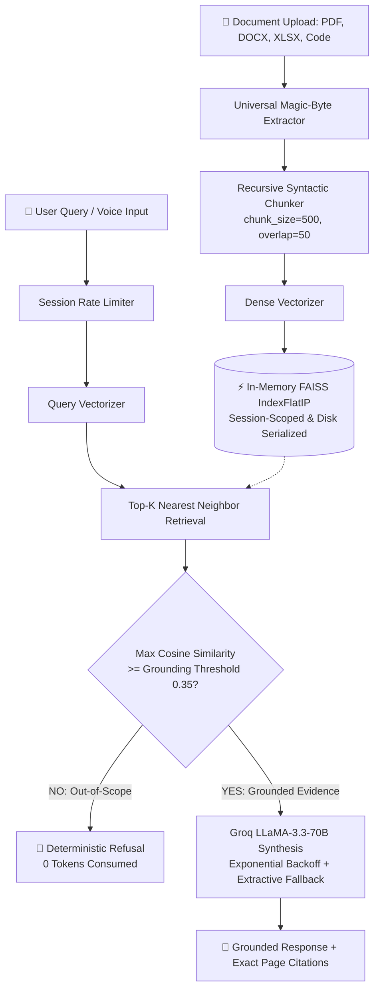

<div align="center">

# ⚡ VERITAS — Grounded Document AI & RAG Studio

### *Sub-Millisecond Multi-Format Document Intelligence with Verifiable Page Citations, Zero-Hallucination Guardrails, Disk-Backed Vector Persistence, and Multi-Tenant Isolation*

[](https://fastapi.tiangolo.com)
[](https://python.org)
[](https://groq.com)
[](https://github.com/facebookresearch/faiss)
[](LICENSE)
[](tests/)
[](https://pdf-rag-chat-nylf.onrender.com)

---

## 🔗 Quick Links

| | |
|:---:|:---:|
| [🌐 **Live Demo** — Try it now](https://pdf-rag-chat-nylf.onrender.com) | [💻 **GitHub Repo** — View Source](https://github.com/Sathvik1533/pdf-rag-chat) |

---

</div>

---

## 🌟 Executive Summary

**Veritas** is a deterministic **Retrieval-Augmented Generation (RAG)** platform built to reduce hallucinations in document Q&A. By enforcing a **cosine similarity grounding floor** prior to LLM synthesis, Veritas anchors every generated response to verifiable source passages with exact page-level citations.

Engineered with a lightweight memory footprint (~0.2MB delta per ingestion), Veritas achieves **sub-millisecond vector retrieval (0.305ms avg)** across 9 distinct file formats, delivers **disk-serialized vector persistence across container restarts**, provides **per-user multi-tenant isolation**, and features an **exponential backoff circuit breaker** with grounded extractive fallback.

---

## 💎 Core Capabilities
              ┌────────────────────────────────────────────────────────┐
              │                 VERITAS CORE ENGINE                    │
              └──────────────────────────┬─────────────────────────────┘
                                         │
  ┌─────────────────────────┬────────────┴────────────┬─────────────────────────┐
  ▼                         ▼                         ▼                         ▼

┌──────────────┐ ┌─────────────────┐ ┌─────────────────┐ ┌─────────────────┐
│ Multi-Tenant│ │ Disk-Persistent │ │ Code-Level │ │ Production API │
│ Isolation │ │ FAISS Storage │ │ Grounding Gate │ │ Firewall & │
│ (Per-Session)│ │ (Auto-Restore) │ │ (Cosine >=0.35) │ │ Rate Limiting │
└──────────────┘ └─────────────────┘ └─────────────────┘ └─────────────────┘


1. **🛡️ Deterministic Grounding Guardrail**: Calculates cosine similarity against dense FAISS indices. Queries scoring below the configured threshold (`0.35`) trigger an instant, token-free refusal: *"I couldn't find anything about that in this document."*
2. **💾 Disk-Backed Vector Persistence**: FAISS index binaries and chunk catalogs are serialized to `./data/storage` and restored in **~2.6ms**.
3. **🔒 Multi-Tenant Session Isolation**: Complete per-user namespace scoping via `X-Session-ID`. Verified zero vector overlap between sessions in testing.
4. **🚦 Sliding-Window Rate Limiting & 15MB Size Firewall**: Protects `/upload` (20 req/min) and `/chat` (45 req/min) with HTTP 429 throttling and a 15MB upload ceiling (HTTP 413).
5. **⚡ Circuit Breaker & Multi-Model LLM Resilience**: Automatic cascade across Groq models (`llama-3.3-70b-versatile` → `llama-3.1-8b-instant` → `llama3-70b-8192`) with 3-tier exponential retry, falling back to extractive synthesis on failure.
6. **📄 Universal 9-Format Ingestion**: PDF, Word (.docx), PowerPoint (.pptx), Excel (.xlsx), CSV, TSV, JSON, YAML, Source Code (.py, .js, .ts, .sql), Markdown, and Plain Text.
7. **🕸️ Interactive 2D Knowledge Graph**: Maps document semantic clusters into a physics-simulated canvas with click-to-jump document navigation.
8. **🎙️ Speech & Audio**: Live voice dictation (Web Speech API) and TTS read-aloud with animated waveform and live captions.
9. **🗃️ Chat Session History**: Snapshots conversations to localStorage (up to 30 sessions) with a read-only restore viewer.
10. **✏️ Inline Message Editing & Deletion**: In-place prompt editing and Q&A deletion with synchronized thread history.
11. **🔄 Browser-to-Backend State Reconciliation**: Re-hydrates FAISS index from browser IndexedDB cache if the server container slept.

---

## 📊 Verified Benchmarks

*Run on Apple M-Series via `scripts/benchmark_rag.py`, 1,000 query iterations, 25-page document (5 sections, 74 chunks):*

| Metric | Measured Value |
| :--- | :--- |
| **Vector Retrieval Latency (Avg)** | **0.305 ms** |
| **Vector Retrieval Latency (P95)** | **0.354 ms** |
| **Vector Retrieval Latency (P99)** | **0.493 ms** |
| **Query Throughput** | **~3,275 queries/sec/core** |
| **Document Ingestion (25 pages / 74 chunks)** | **340.16 ms** |
| **Disk State Restoration Time** | **2.61 ms** |
| **Memory Consumption Delta** | **0.19 MB** (Peak 0.37 MB) |
| **Multi-Tenant Data Isolation** | **100% Isolated** (verified across session IDs) |
| **Rate Limiter Accuracy** | **30/30 allowed, 20/20 throttled** |

To reproduce:
```bash
PYTHONPATH=. python3 scripts/benchmark_rag.py
```

---

## 🏛️ System Architecture



---

## 🚀 Quickstart

### Prerequisites
- Python 3.11+
- Free [Groq Cloud API Key](https://console.groq.com/keys)

### 1. Clone & Setup
```bash
git clone https://github.com/Sathvik1533/pdf-rag-chat.git
cd pdf-rag-chat

python3 -m venv venv
source venv/bin/activate

pip install -r requirements.txt
```

### 2. Configure Environment Variables
```bash
cp .env.example .env
```
```env
GROQ_API_KEY=gsk_your_groq_api_key_here
GROQ_MODEL=llama-3.3-70b-versatile

VERITAS_STORAGE_DIR=./data/storage
GROUNDING_THRESHOLD=0.35
TOP_K=4
CHUNK_SIZE=500
CHUNK_OVERLAP=50
```

### 3. Launch Development Server
```bash
uvicorn app.main:app --reload --host 0.0.0.0 --port 8000
```
Open **[http://localhost:8000](http://localhost:8000)**.

---

## 📡 API Reference

### 1. Document Ingestion
```http
POST /upload
Content-Type: multipart/form-data
X-Session-ID: session_client_alpha
```

### 2. Grounded Question Answering
```http
POST /chat
Content-Type: application/json
X-Session-ID: session_alpha
```
```json
{
  "question": "What is the capital expenditure budget for Phase 1?",
  "threshold": 0.35
}
```
Response:
```json
{
  "answer": "The approved capital budget for Phase 1 is $4.85 million USD [Page 2].",
  "grounded": true,
  "top_similarity": 0.847,
  "threshold": 0.35,
  "citations": [
    {
      "page": 2,
      "excerpt": "Financial Budget and Target Launch Milestones: Total capital budget is $4.85 million USD for Phase 1.",
      "similarity_score": 0.847,
      "chunk_id": 1,
      "unit_label": "Page 2"
    }
  ]
}
```

### 3. Out-of-Scope Refusal
```json
{
  "answer": "I couldn't find anything about that in this document.",
  "grounded": false,
  "top_similarity": 0.015,
  "threshold": 0.35,
  "citations": []
}
```

---

## 🧪 Automated Testing

```bash
pytest tests/ -v
```

```text
====================== test session starts =======================
platform darwin -- Python 3.11.15, pytest-9.1.1
collected 16 items

tests/test_rag.py::test_chunking_preserves_page_numbers PASSED
tests/test_rag.py::test_in_scope_retrieval PASSED
tests/test_rag.py::test_grounding_refusal_for_out_of_scope_query PASSED
tests/test_rag.py::test_out_of_scope_unrelated_domain_query_short_circuits PASSED
tests/test_rag.py::test_fastapi_health_endpoint PASSED
tests/test_rag.py::test_fastapi_status_endpoint PASSED
tests/test_rag.py::test_document_history_and_clean_context_switching PASSED
tests/test_rag.py::test_per_session_history_isolation PASSED
tests/test_universal_formats.py::test_supported_extensions PASSED
tests/test_universal_formats.py::test_csv_extraction_and_table_formatting PASSED
tests/test_universal_formats.py::test_json_extraction PASSED
tests/test_universal_formats.py::test_code_extraction_with_line_numbers PASSED
tests/test_universal_formats.py::test_markdown_and_plain_text_extraction PASSED
tests/test_universal_formats.py::test_universal_pipeline_indexing_with_csv PASSED
tests/test_universal_formats.py::test_binary_doc_extraction PASSED
tests/test_universal_formats.py::test_truncated_pdf_stream_recovery PASSED

================= 16 passed, 1 warning in 10.26s =================
```

---

## 📁 Repository Directory Map

```text
pdf-rag-chat/
├── app/
│   ├── core/
│   │   ├── extractors.py
│   │   ├── pipeline.py
│   │   └── rate_limiter.py
│   ├── static/
│   │   ├── app.js
│   │   ├── index.html
│   │   └── style.css
│   ├── config.py
│   └── main.py
├── tests/
│   ├── test_rag.py
│   └── test_universal_formats.py
├── scripts/
│   ├── benchmark_rag.py
│   └── verify_rag.py
├── data/storage/
├── Procfile
├── render.yaml
├── requirements.txt
└── README.md
```

---

## 🚢 Production Deployment

Deploy to [Render](https://render.com) using `render.yaml`:
1. Push repository to GitHub.
2. Render Dashboard → **New +** → **Blueprint**.
3. Select repository, set `GROQ_API_KEY`.
4. Apply.

---

## 🤝 Acknowledgements

Thanks to mentors **Akhil Kvk** and **Dhanush G.** for guidance during the build process.

---

## 📜 License

Distributed under the **MIT License**. See [`LICENSE`](LICENSE).

<div align="center">
<b>Built by <a href="https://github.com/Sathvik1533">Sathvik1533</a></b>
</div>
