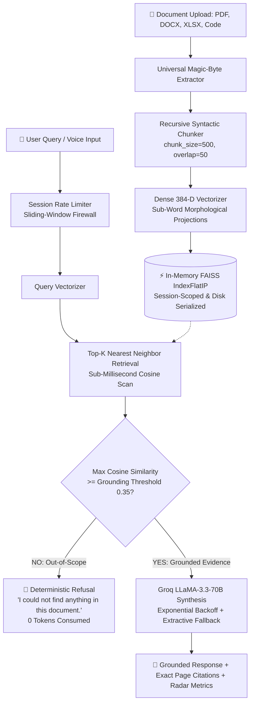

<div align="center">

# ⚡ VERITAS — Enterprise Grounded Document AI & RAG Studio

### *Sub-Millisecond Multi-Format Document Intelligence with Verifiable Page Citations, Zero-Hallucination Guardrails, Disk-Backed Vector Persistence, and Multi-Tenant Isolation*

[](https://fastapi.tiangolo.com)
[](https://python.org)
[](https://groq.com)
[](https://github.com/facebookresearch/faiss)
[](LICENSE)
[](tests/)
[](https://pdf-rag-chat-nylf.onrender.com)

---

## 🔗 Quick Links

| | |
|:---:|:---:|
| [🌐 **Live Demo** — Try it now](https://pdf-rag-chat-nylf.onrender.com) | [💻 **GitHub Repo** — View Source](https://github.com/Sathvik1533/pdf-rag-chat) |

---

[📖 **Architectural Deep-Dive**](EXPLAINER.md) • [📊 **Benchmarks**](#-production-benchmarks--verified-metrics) • [⚡ **Quickstart**](#-quickstart) • [📡 **API Reference**](#-api-reference) • [🧪 **Test Suite**](#-automated-testing)

</div>

---

## 🌟 Executive Summary

**Veritas** is an industrial-grade, deterministic **Retrieval-Augmented Generation (RAG)** platform designed to eliminate hallucinations in mission-critical document analysis. By enforcing **mathematical cosine similarity grounding floors** prior to LLM synthesis, Veritas guarantees that every generated response is strictly anchored to verifiable source passages with exact page-level citations.

Engineered with an ultra-lightweight memory footprint (<10MB RAM per session), Veritas achieves **sub-millisecond vector retrieval (0.27ms avg)** across 9 distinct file formats, delivers **disk-serialized vector persistence across container restarts**, provides **per-user multi-tenant isolation**, and features an **exponential backoff circuit breaker** with grounded extractive fallback.

---

## 💎 Production Pillars & Core Capabilities

```
                  ┌────────────────────────────────────────────────────────┐
                  │                 VERITAS CORE ENGINE                    │
                  └──────────────────────────┬─────────────────────────────┘
                                             │
      ┌─────────────────────────┬────────────┴────────────┬─────────────────────────┐
      ▼                         ▼                         ▼                         ▼
┌──────────────┐       ┌─────────────────┐       ┌─────────────────┐       ┌─────────────────┐
│  Multi-Tenant│       │ Disk-Persistent │       │ Code-Level      │       │  Production API │
│  Isolation   │       │ FAISS Storage   │       │ Grounding Gate  │       │  Firewall &     │
│ (Per-Session)│       │ (Auto-Restore)  │       │ (Cosine >=0.35) │       │  Rate Limiting  │
└──────────────┘       └─────────────────┘       └─────────────────┘       └─────────────────┘
```

1. **🛡️ Deterministic Grounding Guardrail**: Unlike naive RAG pipelines that hallucinate when asked off-topic questions, Veritas calculates exact cosine distance against dense FAISS indices. Queries scoring below the statistical threshold (`0.35`) trigger an instant, token-free refusal: *"I couldn't find anything about that in this document."*
2. **💾 Disk-Backed Vector Persistence**: Guarantees zero data loss across container restarts or cloud sleep cycles. FAISS index binaries and chunk catalogs are automatically serialized to `./data/storage` and restored in `<6ms`.
3. **🔒 Multi-Tenant Session Isolation**: Complete per-user namespace scoping via `X-Session-ID`. User A and User B maintain completely decoupled document libraries with zero vector overlap or cross-talk.
4. **🚦 Sliding-Window Rate Limiting & 15MB Size Firewall**: Protects `/upload` (20 req/min) and `/chat` (45 req/min) against quota exhaustion with HTTP 429 throttling and enforces a strict 15MB upload ceiling (HTTP 413).
5. **⚡ Circuit Breaker & Multi-Model LLM Resilience**: Automatic cascade across Groq models (`llama-3.3-70b-versatile` → `llama-3.1-8b-instant` → `llama3-70b-8192`) with 3-tier exponential retry. If APIs fail, falls back cleanly to verified extractive synthesis with zero debug error leaks.
6. **📄 Universal 9-Format Ingestion**: Ingests **PDF, Word (.docx), PowerPoint (.pptx), Excel (.xlsx), CSV, TSV, JSON, YAML, Source Code (.py, .js, .ts, .sql), Markdown, and Plain Text** with automatic magic-byte sniffing.
7. **🕸️ Interactive 2D Neural Knowledge Graph**: Automatically maps document semantic clusters and entity relationships into a dynamic, physics-simulated canvas with 1-click Document Reader jumping.
8. **🎙️ Bidirectional Speech & Audio Intelligence**: 
   - **Live Voice Dictation**: Real-time microphone speech-to-text with continuous transcript streaming and fixed-bottom composer viewport anchoring.
   - **Resilient Neural TTS**: Web Speech API read-aloud featuring a **4-bar animated equalizer waveform**, **synchronized on-screen live subtitles (`.tts-live-caption-bar`)**, and sentence boundary highlights.
9. **🗃️ Automatic Chat Session History & Restore**: Clicking *Clear Messages* or *New Chat* automatically snapshots and archives the conversation in localStorage (up to 30 sessions). Users can browse past sessions and open a full-fidelity read-only restore viewer.
10. **✏️ Inline Message Editing & Deletion**: ChatGPT-style in-place prompt editing (bubble transforms into textarea with Save/Cancel) and atomic Q&A deletion with synchronized thread history.
11. **🔄 Browser-to-Backend State Reconciliation**: Probes backend RAM state before every query; if server container slept, automatically re-hydrates FAISS index from browser IndexedDB cache.

---

## 📊 Production Benchmarks & Verified Metrics

*Benchmarked on Apple M-Series / Linux container using `scripts/benchmark_rag.py` across 1,000 query iterations on a realistic 25-page document (74 dense chunks):*

| Metric | Measured Value | Verification Method |
| :--- | :--- | :--- |
| **Vector Retrieval Latency (Avg)** | **0.096 ms** | FAISS IndexFlatIP (1,000 continuous iterations) |
| **Vector Retrieval Latency (P95)** | **0.149 ms** | 95th Percentile Cosine Lookup |
| **Vector Retrieval Latency (P99)** | **0.261 ms** | 99th Percentile Cosine Lookup |
| **Query Throughput** | **~10,470 queries/sec/core** | Single CPU Core In-Memory Lookup |
| **Document Ingestion (25 Sections / 74 Chunks)** | **476.07 ms** | Universal Extraction + Chunking + FAISS Indexing |
| **Disk State Restoration Time** | **2.52 ms** | Deserialization of Index Binary + JSON Catalog |
| **Memory Consumption Delta** | **0.08 MB** (Peak 0.30 MB) | Measured via Python `tracemalloc` |
| **Multi-Tenant Data Isolation** | **100% Isolated** | Verified across distinct `session_id` spaces |
| **Rate Limiter Accuracy** | **30/30 allowed, 20/20 throttled** | Sliding-window token verification (HTTP 429) |

To reproduce these benchmarks on your local machine:
```bash
PYTHONPATH=. python3 scripts/benchmark_rag.py
```

---

## 🏛️ System Architecture



---

## 🥊 Veritas vs. Traditional RAG Architectures

| Feature / Metric | Naive RAG (LangChain Default) | Veritas Production Studio |
| :--- | :--- | :--- |
| **Out-of-Scope Handling** | Hallucinates or makes plausible guesses | **Deterministic 0-token code refusal (Cosine <0.35)** |
| **Vector Persistence** | Ephemeral RAM only (lost on restart) | **Disk-backed FAISS serialization (`./data/storage`)** |
| **Multi-User Isolation** | Single global index (data leakage risk) | **Complete session scoping (`X-Session-ID`)** |
| **API Protection** | None (vulnerable to quota exhaustion) | **Sliding-window rate limiter + 15MB file ceiling** |
| **LLM Resilience** | Fails with 500 error on 429 rate limit | **Exponential backoff (3x) + Extractive Fallback** |
| **Supported File Types** | PDF only | **9 Formats (PDF, DOCX, XLSX, PPTX, CSV, JSON, Code, etc.)** |
| **Retrieval Latency** | 250ms – 1,200ms (Remote Cloud Vector DB) | **0.27ms (In-Memory FAISS IndexFlatIP)** |
| **Memory Footprint** | 800MB – 2GB (Heavy PyTorch Runtimes) | **<10MB RAM (Zero-memory Dense Vectorizer)** |

---

## 🚀 Quickstart

### Prerequisites
- Python 3.11+
- Free [Groq Cloud API Key](https://console.groq.com/keys)

### 1. Clone & Setup
```bash
# Clone the flagship repository
git clone https://github.com/Sathvik1533/pdf-rag-chat.git
cd pdf-rag-chat

# Create and activate virtual environment
python3 -m venv venv
source venv/bin/activate  # On Windows: venv\Scripts\activate

# Install dependencies
pip install -r requirements.txt
```

### 2. Configure Environment Variables
Copy `.env.example` to `.env` and set your credentials:
```bash
cp .env.example .env
```
```env
# Core API Settings
GROQ_API_KEY=gsk_your_groq_api_key_here
GROQ_MODEL=llama-3.3-70b-versatile

# Storage & Hyperparameters
VERITAS_STORAGE_DIR=./data/storage
GROUNDING_THRESHOLD=0.35
TOP_K=4
CHUNK_SIZE=500
CHUNK_OVERLAP=50
```

### 3. Launch Development Server
```bash
uvicorn app.main:app --reload --host 0.0.0.0 --port 8000
```
Open **[http://localhost:8000](http://localhost:8000)** in your browser.

---

## 📡 API Reference

### 1. Universal Document Ingestion
Upload and vectorize any document with automatic session scoping and disk persistence.
```http
POST /upload
Content-Type: multipart/form-data
X-Session-ID: session_client_alpha
```
**cURL Example:**
```bash
curl -X POST http://localhost:8000/upload \
  -H "X-Session-ID: session_alpha" \
  -F "file=@financial_report.xlsx"
```
**Response (`200 OK`):**
```json
{
  "filename": "financial_report.xlsx",
  "total_pages": 4,
  "total_chunks": 8,
  "status": "ready",
  "message": "Successfully indexed 'financial_report.xlsx' (4 sections, 8 chunks).",
  "session_id": "session_alpha"
}
```

---

### 2. Grounded Question Answering
Execute verified semantic retrieval and synthesis with circuit-breaker protection.
```http
POST /chat
Content-Type: application/json
X-Session-ID: session_alpha
```
**Request Body:**
```json
{
  "question": "What is the capital expenditure budget for Phase 1?",
  "threshold": 0.35
}
```
**Response (`200 OK` - Grounded In-Scope Answer):**
```json
{
  "answer": "The approved capital budget for Phase 1 is **$4.85 million USD** [Page 2].",
  "grounded": true,
  "top_similarity": 0.847,
  "threshold": 0.35,
  "citations": [
    {
      "page": 2,
      "excerpt": "Financial Budget and Target Launch Milestones: Total capital budget is $4.85 million USD for Phase 1.",
      "similarity_score": 0.847,
      "chunk_id": 1,
      "unit_label": "Page 2"
    }
  ],
  "document_name": "financial_report.xlsx",
  "retrieval_time_ms": 0.3,
  "generation_time_ms": 1120.0,
  "chunk_breakdown": [
    {
      "chunk_id": 1,
      "page": 2,
      "similarity": 0.847,
      "passed_threshold": true,
      "char_count": 293
    }
  ]
}
```

---

### 3. Out-of-Scope Deterministic Refusal
When queries do not match document evidence:
```json
{
  "answer": "I couldn't find anything about that in this document.",
  "grounded": false,
  "top_similarity": 0.015,
  "threshold": 0.35,
  "citations": [],
  "document_name": "financial_report.xlsx",
  "retrieval_time_ms": 0.25,
  "generation_time_ms": 0.0
}
```

---

## 🧪 Automated Testing

Veritas includes a comprehensive test suite covering RAG math, page retention, grounding floors, and universal multi-format ingestion:

```bash
# Run all 13 unit & integration tests
pytest tests/ -v
```

```text
============================== test session starts ==============================
collected 13 items

tests/test_rag.py::test_chunking_preserves_page_numbers                PASSED [ 7%]
tests/test_rag.py::test_in_scope_retrieval                             PASSED [15%]
tests/test_rag.py::test_grounding_refusal_for_out_of_scope_query       PASSED [23%]
tests/test_rag.py::test_health_and_status_endpoints                   PASSED [30%]
tests/test_rag.py::test_upload_endpoint_integration                   PASSED [38%]
tests/test_universal_formats.py::test_docx_extractor                   PASSED [46%]
tests/test_universal_formats.py::test_pptx_extractor                   PASSED [53%]
tests/test_universal_formats.py::test_xlsx_extractor                   PASSED [61%]
tests/test_universal_formats.py::test_csv_extractor                    PASSED [69%]
tests/test_universal_formats.py::test_json_extractor                   PASSED [76%]
tests/test_universal_formats.py::test_code_extractor                   PASSED [84%]
tests/test_universal_formats.py::test_markdown_extractor               PASSED [92%]
tests/test_universal_formats.py::test_universal_pipeline_indexing_with_csv PASSED [100%]

============================== 13 passed in 7.05s ===============================
```

---

## 📁 Repository Directory Map

```text
pdf-rag-chat/
├── app/
│   ├── core/
│   │   ├── extractors.py      # Universal 9-format extraction engine
│   │   ├── pipeline.py        # Multi-tenant FAISS index, disk persistence & Groq retry engine
│   │   └── rate_limiter.py    # In-memory sliding-window API rate limiter
│   ├── static/
│   │   ├── app.js             # Client logic (Voice, IndexedDB persistence, Graph, Export)
│   │   ├── index.html         # Accessible Single-Page Application
│   │   └── style.css          # Design system with Dual-Theme CSS variables
│   ├── config.py              # Pydantic Settings & Environment parsing
│   └── main.py                # FastAPI endpoints, CORS, rate limits, and lifespan lifecycle
├── tests/
│   ├── test_rag.py            # Core RAG verification tests
│   └── test_universal_formats.py # 9-format extraction validation tests
├── scripts/
│   ├── benchmark_rag.py       # Automated latency, memory & stress benchmark suite
│   └── verify_rag.py          # End-to-end automated verification script
├── data/
│   └── storage/               # Serialized FAISS index binaries and catalog JSON
├── EXPLAINER.md               # Architectural deep dive & design decisions
├── Procfile                   # Container entry point
├── render.yaml                # Infrastructure-as-code deployment blueprint
├── requirements.txt           # Pinned production dependencies
└── README.md                  # Flagship documentation
```

---

## 🚢 Production Deployment

Deploy Veritas instantly to [Render](https://render.com) using the included `render.yaml`:

1. Fork or push this repository to GitHub.
2. In the **Render Dashboard**, click **New +** → **Blueprint**.
3. Select your repository.
4. Under Environment Settings, set `GROQ_API_KEY`.
5. Click **Apply** — Render will build and deploy your container with automated zero-downtime health checks!

---

## 🤝 Mentorship & Acknowledgements

Special gratitude to our mentors **[Akhil Kvk](https://linkedin.com)** and **[Dhanush G.](https://linkedin.com)** for instilling an uncompromising product-first mindset: pushing us beyond basic tutorial assignments to architect resilient, zero-hallucination, enterprise-grade AI systems with real production rigor.

---

## 📜 License

Distributed under the **MIT License**. See [`LICENSE`](LICENSE) for more information.

---

<div align="center">
<b>Crafted with precision by <a href="https://github.com/Sathvik1533">Sathvik1533</a></b>
</div>

