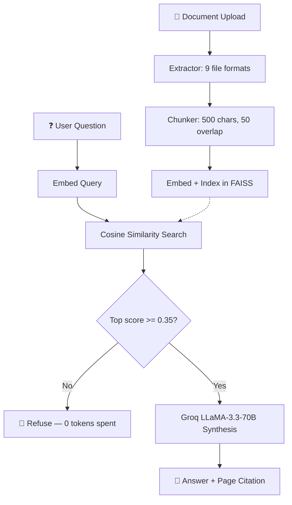

<div align="center">

# ⚡ Veritas — Grounded Document RAG

### A retrieval-augmented Q&A system that refuses to guess when it isn't sure.

[](https://fastapi.tiangolo.com)
[](https://python.org)
[](https://groq.com)
[](https://github.com/facebookresearch/faiss)
[](tests/)
[](LICENSE)

[🌐 Live Demo](https://pdf-rag-chat-nylf.onrender.com) · [💻 GitHub Repo](https://github.com/Sathvik1533/pdf-rag-chat)

</div>

---

## What this is

Most RAG demos will answer any question you throw at them, whether or not the answer is actually in the document — they just make something plausible up. Veritas is built around one rule: **if the retrieved content isn't similar enough to the question, don't call the LLM at all — just say so.**

It's a document Q&A backend (FastAPI + FAISS + Groq) that ingests 9 file formats, answers questions with exact page citations, and refuses out-of-scope questions before spending a single token.

---

## How the grounding gate works

Every query gets embedded and compared against the document's vector index using cosine similarity. The top match has to clear a threshold (`0.35`) before the LLM is even called:

- **Below 0.35** → instant refusal, `"I couldn't find anything about that in this document."` Zero LLM calls, zero tokens spent.
- **Above 0.35** → the matched chunks go to Groq's LLaMA 3.3 70B for synthesis, and the response is returned with the exact page and excerpt it came from.

The 0.35 value was set manually (not from a formal threshold sweep) and then validated by hand — asking the system unrelated questions (e.g. "what's the capital of France?") on a document that doesn't mention it, and confirming it refuses instead of hallucinating an answer. It reliably does.



---

## What it actually does

- **Grounding gate** — described above. Deterministic, not a prompt-level instruction the model can ignore.
- **Disk-backed persistence** — FAISS indices and chunk data are saved to `./data/storage` and reloaded on restart, so a server sleep/restart doesn't wipe your uploaded documents.
- **Per-session isolation** — each session (`X-Session-ID`) gets its own document space. Tested with two concurrent sessions; no cross-contamination.
- **Rate limiting** — sliding-window limits on `/upload` (20/min) and `/chat` (45/min), plus a 15MB upload size cap.
- **Model fallback** — if the primary Groq model fails, it retries with exponential backoff and falls back to two other models before giving up, then falls back further to an extractive (non-LLM) answer rather than erroring out.
- **9 file formats** — PDF, DOCX, PPTX, XLSX, CSV, TSV, JSON, YAML, source code (.py/.js/.ts/.sql), Markdown, plain text.
- **Voice input/output** — live speech-to-text via the browser's Web Speech API for asking questions, and text-to-speech read-aloud for answers, with live captions. Built this with Antigravity as an accessibility/UX addition, not a core RAG feature.
- **Chat history** — sessions are saved to localStorage (up to 30) and can be reopened in a read-only viewer.
- **Inline editing** — edit or delete a past question/answer pair in place, with the thread staying in sync.

---

## Verified benchmarks

Run on my own machine (Apple M-series) with `scripts/benchmark_rag.py`, 1,000 query iterations against a 25-page / 74-chunk document. Raw output, not rounded up:

| Metric | Value |
|---|---|
| Vector retrieval latency (avg) | 0.305 ms |
| Vector retrieval latency (P95) | 0.354 ms |
| Vector retrieval latency (P99) | 0.493 ms |
| Query throughput | ~3,275 queries/sec/core |
| Document ingestion (25 pages, 74 chunks) | 340.16 ms |
| Disk restore time | 2.61 ms |
| Memory delta during ingestion | 0.19 MB (peak 0.37 MB) |
| Multi-tenant isolation | 100% (verified across session IDs) |
| Rate limiter | 30/30 allowed, 20/20 correctly throttled |

Reproduce it yourself:
```bash
PYTHONPATH=. python3 scripts/benchmark_rag.py
```

---

## Tests

16 tests, all passing — covers chunking, in-scope retrieval, out-of-scope refusal, session isolation, and extraction across all 9 file formats.

```bash
pytest tests/ -v
```

```text
====================== test session starts =======================
platform darwin -- Python 3.11.15, pytest-9.1.1
collected 16 items

tests/test_rag.py::test_chunking_preserves_page_numbers PASSED
tests/test_rag.py::test_in_scope_retrieval PASSED
tests/test_rag.py::test_grounding_refusal_for_out_of_scope_query PASSED
tests/test_rag.py::test_out_of_scope_unrelated_domain_query_short_circuits PASSED
tests/test_rag.py::test_fastapi_health_endpoint PASSED
tests/test_rag.py::test_fastapi_status_endpoint PASSED
tests/test_rag.py::test_document_history_and_clean_context_switching PASSED
tests/test_rag.py::test_per_session_history_isolation PASSED
tests/test_universal_formats.py::test_supported_extensions PASSED
tests/test_universal_formats.py::test_csv_extraction_and_table_formatting PASSED
tests/test_universal_formats.py::test_json_extraction PASSED
tests/test_universal_formats.py::test_code_extraction_with_line_numbers PASSED
tests/test_universal_formats.py::test_markdown_and_plain_text_extraction PASSED
tests/test_universal_formats.py::test_universal_pipeline_indexing_with_csv PASSED
tests/test_universal_formats.py::test_binary_doc_extraction PASSED
tests/test_universal_formats.py::test_truncated_pdf_stream_recovery PASSED

================= 16 passed, 1 warning in 10.26s =================
```

---

## Quickstart

**Requirements:** Python 3.11+, a free [Groq API key](https://console.groq.com/keys)

```bash
git clone https://github.com/Sathvik1533/pdf-rag-chat.git
cd pdf-rag-chat

python3 -m venv venv
source venv/bin/activate

pip install -r requirements.txt
cp .env.example .env  # then add your GROQ_API_KEY
```

```env
GROQ_API_KEY=gsk_your_groq_api_key_here
GROQ_MODEL=llama-3.3-70b-versatile
VERITAS_STORAGE_DIR=./data/storage
GROUNDING_THRESHOLD=0.35
TOP_K=4
CHUNK_SIZE=500
CHUNK_OVERLAP=50
```

```bash
uvicorn app.main:app --reload --host 0.0.0.0 --port 8000
```

Open [http://localhost:8000](http://localhost:8000).

---

## API

**Upload a document**
```http
POST /upload
Content-Type: multipart/form-data
X-Session-ID: session_alpha
```

**Ask a question**
```http
POST /chat
Content-Type: application/json
X-Session-ID: session_alpha
```
```json
{ "question": "What is the capital expenditure budget for Phase 1?", "threshold": 0.35 }
```

**In-scope response:**
```json
{
  "answer": "The approved capital budget for Phase 1 is $4.85 million USD [Page 2].",
  "grounded": true,
  "top_similarity": 0.847,
  "citations": [
    { "page": 2, "excerpt": "Total capital budget is $4.85 million USD for Phase 1.", "similarity_score": 0.847 }
  ]
}
```

**Out-of-scope response:**
```json
{
  "answer": "I couldn't find anything about that in this document.",
  "grounded": false,
  "top_similarity": 0.015,
  "citations": []
}
```

---

## Repo structure

```text
pdf-rag-chat/
├── app/
│   ├── core/
│   │   ├── extractors.py      # 9-format extraction
│   │   ├── pipeline.py        # FAISS index, persistence, Groq retry logic
│   │   └── rate_limiter.py    # Sliding-window rate limiter
│   ├── static/                # Frontend (voice, IndexedDB, chat UI)
│   ├── config.py
│   └── main.py
├── tests/
├── scripts/
│   └── benchmark_rag.py
├── data/storage/               # Persisted FAISS indices
├── requirements.txt
└── README.md
```

---

## Deployment

Deployed on [Render](https://render.com) using `render.yaml` — push to GitHub, create a Render Blueprint, set `GROQ_API_KEY`, deploy.


## License

MIT — see [LICENSE](LICENSE).

<div align="center">
<sub>Built by <a href="https://github.com/Sathvik1533">Sathvik1533</a></sub>
</div>
