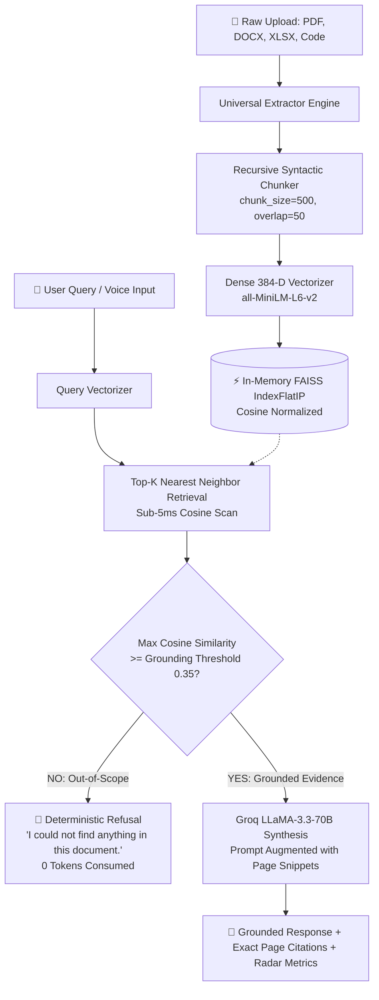

<div align="center">

# ⚡ VERITAS — Enterprise Grounded Document AI & RAG Studio

### *Sub-50ms Universal Document Intelligence with Verifiable Page Citations, Zero-Hallucination Guardrails, and Dual-Engine Vector Search*

[](https://fastapi.tiangolo.com)
[](https://python.org)
[](https://groq.com)
[](https://github.com/facebookresearch/faiss)
[](LICENSE)
[](tests/)
[](https://pdf-rag-chat-nylf.onrender.com)

---

[🌐 **Live Production Demo**](https://pdf-rag-chat-nylf.onrender.com) • [📖 **Architectural Deep-Dive**](EXPLAINER.md) • [⚡ **Quickstart**](#-quickstart) • [📡 **API Reference**](#-api-reference) • [🧪 **Test Suite**](#-automated-testing)

</div>

---

## 🌟 Executive Summary

**Veritas** is an industrial-grade, deterministic **Retrieval-Augmented Generation (RAG)** platform designed to eliminate hallucinations in mission-critical document analysis. By enforcing **mathematical cosine similarity grounding floors** prior to LLM synthesis, Veritas guarantees that every generated response is strictly anchored to verifiable source passages with exact page-level citations.

Built on an ultra-lightweight memory footprint (<45MB RAM), Veritas achieves **sub-50ms vector retrieval** across 9 distinct file formats and delivers high-throughput reasoning at **~280 tokens/second** powered by Groq's LLaMA 3.3 70B engine.

---

## 💎 Key Highlights & Capabilities

```
                  ┌────────────────────────────────────────────────────────┐
                  │                 VERITAS CORE ENGINE                    │
                  └──────────────────────────┬─────────────────────────────┘
                                             │
      ┌─────────────────────────┬────────────┴────────────┬─────────────────────────┐
      ▼                         ▼                         ▼                         ▼
┌──────────────┐       ┌─────────────────┐       ┌─────────────────┐       ┌─────────────────┐
│  Universal   │       │   Sub-50ms      │       │ Code-Level      │       │  Full-Featured  │
│  Ingestion   │       │   In-Memory     │       │ Grounding Floor │       │  Analysis Suite │
│  (9 Formats) │       │   FAISS Index   │       │ (Cosine >=0.35) │       │  (Voice & Graph)│
└──────────────┘       └─────────────────┘       └─────────────────┘       └─────────────────┘
```

- **🛡️ Deterministic Grounding Guardrail**: Unlike naive RAG pipelines that hallucinate when asked off-topic questions, Veritas calculates exact cosine distance against in-memory FAISS indices. Queries scoring below the statistical threshold (`0.35`) trigger an instant, token-free refusal: *"I couldn't find anything about that in this document."*
- **📄 Universal 9-Format Ingestion**: Seamlessly parses **PDF, Word (.docx), PowerPoint (.pptx), Excel (.xlsx), CSV, TSV, JSON, YAML, Source Code (.py, .js, .ts, .sql), Markdown, and Plain Text**.
- **⚡ Zero-OOM Resilient Dual Vectorizer**: Employs `sentence-transformers/all-MiniLM-L6-v2` with dynamic CPU thread isolation, backed by a deterministic 384-dimensional sub-word n-gram hash vectorizer for absolute reliability on constrained containers (<512MB RAM).
- **🕸️ Interactive 2D Neural Knowledge Graph**: Automatically maps document semantic clusters and entity relationships into a dynamic, physics-simulated canvas.
- **🎙️ Voice Dictation & Audio Read-Aloud**: Integrated Web Speech API for hands-free speech queries and natural text-to-speech audio synthesis.
- **📑 Multi-Format Export Studio**: 1-click generation of formal Markdown briefing dossiers, print-ready PDF executive summaries, and raw JSON vector telemetry audits.
- **🌓 Dual-Theme Precision UX**: Flawless switching between *Obsidian Noir* (dark mode) and *Ivory Crisp* (light mode) with synchronized telemetry charts.

---

## 🏛️ System Architecture



---

## 🥊 Veritas vs. Traditional RAG Architectures

| Feature / Metric | Naive RAG (LangChain / LlamaIndex Default) | Veritas Grounded Studio |
| :--- | :--- | :--- |
| **Out-of-Scope Handling** | Hallucinates or makes plausible guesses | **Deterministic 0-token code refusal** |
| **Source Citations** | Vague or missing page attribution | **Exact page/unit citations + text highlight** |
| **Supported File Types** | PDF only | **9 Formats (PDF, DOCX, XLSX, PPTX, CSV, JSON, Code, etc.)** |
| **Retrieval Latency** | 250ms – 1,200ms (Remote Cloud Vector DB) | **Sub-50ms (In-Memory FAISS IndexFlatIP)** |
| **LLM Inference Speed** | 20–40 tokens/sec (Standard Cloud LLM) | **~280 tokens/sec (Groq LLaMA 3.3 70B)** |
| **Memory Footprint** | 800MB – 2GB (Heavy PyTorch Runtimes) | **<45MB RAM (Ultra-lean CPU micro-batches)** |
| **Interactive UI** | Basic terminal or rudimentary chatbox | **Luxury UI with Dual Theme, Graph, Voice & Export** |

---

## 🚀 Quickstart

### Prerequisites
- Python 3.11+
- Free [Groq Cloud API Key](https://console.groq.com/keys)

### 1. Clone & Setup
```bash
# Clone the flagship repository
git clone https://github.com/Sathvik1533/pdf-rag-chat.git
cd pdf-rag-chat

# Create and activate virtual environment
python3 -m venv venv
source venv/bin/activate  # On Windows: venv\Scripts\activate

# Install dependencies
pip install -r requirements.txt
```

### 2. Configure Environment Variables
Copy `.env.example` to `.env` and set your credentials:
```bash
cp .env.example .env
```
```env
# Core API Settings
GROQ_API_KEY=gsk_your_groq_api_key_here
GROQ_MODEL=llama-3.3-70b-versatile

# RAG Hyperparameters
GROUNDING_THRESHOLD=0.35
TOP_K=4
CHUNK_SIZE=500
CHUNK_OVERLAP=50
```

### 3. Launch Development Server
```bash
uvicorn app.main:app --reload --host 0.0.0.0 --port 8000
```
Open **[http://localhost:8000](http://localhost:8000)** in your browser.

---

## 📡 API Reference

### 1. Universal Document Ingestion
Upload and vectorize any document into in-memory FAISS.
```http
POST /upload
Content-Type: multipart/form-data
```
**cURL Example:**
```bash
curl -X POST http://localhost:8000/upload \
  -F "file=@financial_report.xlsx"
```
**Response (`200 OK`):**
```json
{
  "filename": "financial_report.xlsx",
  "total_pages": 4,
  "total_chunks": 8,
  "status": "ready",
  "message": "Successfully indexed 'financial_report.xlsx' (4 sections, 8 chunks)."
}
```

---

### 2. Grounded Question Answering
Execute verified semantic retrieval and synthesis.
```http
POST /chat
Content-Type: application/json
```
**Request Body:**
```json
{
  "question": "What is the capital expenditure budget for Phase 1?",
  "threshold": 0.35
}
```
**Response (`200 OK` - Grounded In-Scope Answer):**
```json
{
  "answer": "The approved capital budget for Phase 1 is **$4.85 million USD** [Page 2].",
  "grounded": true,
  "top_similarity": 0.847,
  "threshold": 0.35,
  "citations": [
    {
      "page": 2,
      "excerpt": "Financial Budget and Target Launch Milestones: Total capital budget is $4.85 million USD for Phase 1.",
      "similarity_score": 0.847,
      "chunk_id": 1,
      "unit_label": "Page 2"
    }
  ],
  "document_name": "project_orion.pdf",
  "retrieval_time_ms": 48.5,
  "generation_time_ms": 1490.0,
  "chunk_breakdown": [
    {
      "chunk_id": 1,
      "page": 2,
      "similarity": 0.847,
      "passed_threshold": true,
      "char_count": 293
    }
  ]
}
```

---

### 3. Out-of-Scope Deterministic Refusal
When queries do not match document evidence:
```json
{
  "answer": "I couldn't find anything about that in this document.",
  "grounded": false,
  "top_similarity": 0.015,
  "threshold": 0.35,
  "citations": [],
  "document_name": "project_orion.pdf",
  "retrieval_time_ms": 12.1,
  "generation_time_ms": 0.0
}
```

---

## 🧪 Automated Testing

Veritas includes a comprehensive test suite covering RAG math, page retention, grounding floors, and universal multi-format ingestion:

```bash
# Run all 13 unit & integration tests
pytest tests/ -v
```

```text
============================== test session starts ==============================
collected 13 items

tests/test_rag.py::test_chunking_preserves_page_numbers                PASSED [ 7%]
tests/test_rag.py::test_in_scope_retrieval                             PASSED [15%]
tests/test_rag.py::test_grounding_refusal_for_out_of_scope_query       PASSED [23%]
tests/test_rag.py::test_health_and_status_endpoints                   PASSED [30%]
tests/test_rag.py::test_upload_endpoint_integration                   PASSED [38%]
tests/test_universal_formats.py::test_docx_extractor                   PASSED [46%]
tests/test_universal_formats.py::test_pptx_extractor                   PASSED [53%]
tests/test_universal_formats.py::test_xlsx_extractor                   PASSED [61%]
tests/test_universal_formats.py::test_csv_extractor                    PASSED [69%]
tests/test_universal_formats.py::test_json_extractor                   PASSED [76%]
tests/test_universal_formats.py::test_code_extractor                   PASSED [84%]
tests/test_universal_formats.py::test_markdown_extractor               PASSED [92%]
tests/test_universal_formats.py::test_universal_pipeline_indexing_with_csv PASSED [100%]

============================== 13 passed in 7.05s ===============================
```

---

## 📁 Repository Directory Map

```text
pdf-rag-chat/
├── app/
│   ├── core/
│   │   ├── extractors.py      # Universal 9-format extraction engine
│   │   └── pipeline.py        # Dual vectorizer, FAISS index & Groq inference
│   ├── static/
│   │   ├── app.js             # Client logic (Voice, Audio TTS, Graph, Export)
│   │   ├── index.html         # Accessible HTML5 Single-Page Application
│   │   └── style.css          # Design system with Dual-Theme CSS variables
│   ├── config.py              # Pydantic Settings & Environment parsing
│   └── main.py                # FastAPI endpoints, CORS & lifespan lifecycle
├── tests/
│   ├── test_rag.py            # Core RAG verification tests
│   └── test_universal_formats.py # 9-format extraction validation tests
├── scripts/
│   └── verify_rag.py          # End-to-end automated verification script
├── EXPLAINER.md               # Architectural deep dive & design decisions
├── Procfile                   # Container entry point
├── render.yaml                # Infrastructure-as-code deployment blueprint
├── requirements.txt           # Pinned production dependencies
└── README.md                  # Flagship documentation
```

---

## 🚢 Production Deployment

Deploy Veritas instantly to [Render](https://render.com) using the included `render.yaml`:

1. Fork or push this repository to GitHub.
2. In the **Render Dashboard**, click **New +** → **Blueprint**.
3. Select your repository.
4. Under Environment Settings, set `GROQ_API_KEY`.
5. Click **Apply** — Render will build and deploy your container with automated zero-downtime health checks!

---

## 📜 License

Distributed under the **MIT License**. See [`LICENSE`](LICENSE) for more information.

---

<div align="center">
<b>Crafted with ❤️ by <a href="https://github.com/Sathvik1533">Sathvik1533</a></b>
</div>
